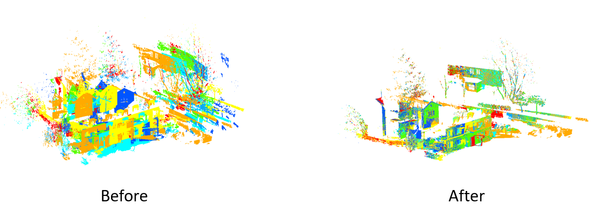

## OPMWF
A Novel Output Port- and Minimum Weight First-Based Registration Algorithm for Multiview Point Clouds (2024) by Kuo-Liang Chung and Yen-Bo Chen.


The left figure is the testing set "Facade" selected from the [ETH](https://projects.asl.ethz.ch/datasets/doku.php?id=laserregistration:laserregistration) dataset, and the right one is the registration result using our method.

## Acknowledgments
The programing implementation of our method is based on:

[H. Wu](https://www.researchgate.net/profile/Wu-Hao-26), and [P. Wei](https://www.researchgate.net/profile/Pengcheng-Wei-3), “A hierarchical multiview registration framework of TLS point clouds based
on loop constraint,” *ISPRS J. Photogramm. Remote Sens.* 2023. ([ISPRS](https://www.sciencedirect.com/science/article/pii/S092427162200291X)) ([github](https://github.com/WuHao-WHU/HL-MRF))

We appreciate the authors for sharing their codes.

## Usage

To compile and install the codes, follow these steps.

```bash
# Install prerequisites
sudo apt install cmake libeigen3-dev libboost-all-dev

# Clone the repository
git clone https://github.com/owenalice324/OPMWF.git

# Build OPMWF
cd OPMWF
mkdir build
cd build
cmake ..
make
cd ..

## Compile the example applications
sh script/run.sh
```

## Testing enviroment
* Linux system (Ubuntu 20.04.6 )
* ISO C++ 14

## Contact
If you have any questions, please email us via   
Yen-Bo Chen: owenalice324@gmail.com 
Kuo-Liang Chung: klchung01@gmail.com
